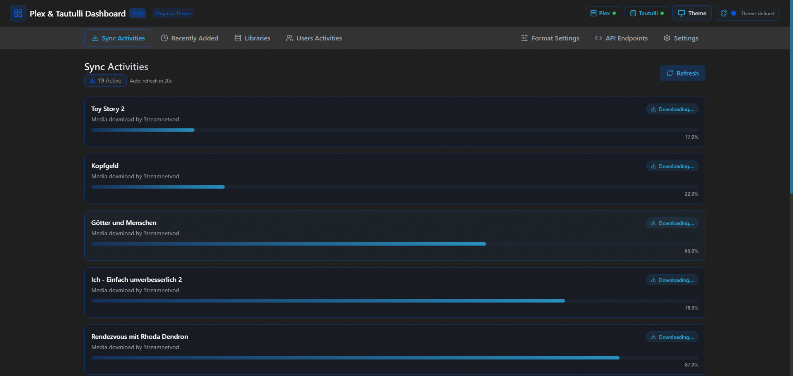
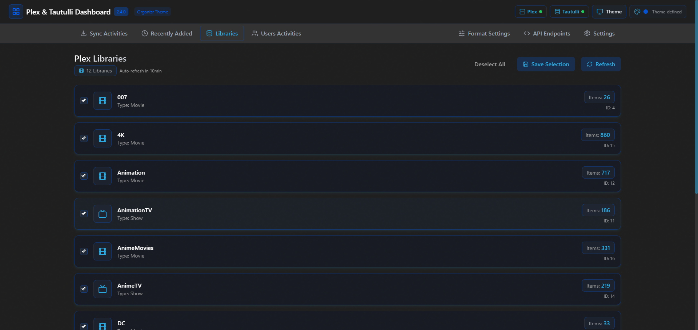
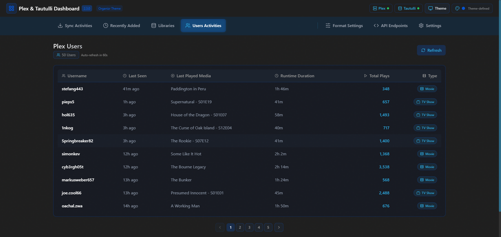

<div align="center">

# 🎬 Plex & Tautulli Dashboard 📊


A modern, elegant dashboard for monitoring your Plex Media Server and Tautulli statistics, featuring a dark-themed UI with customizable displays and real-time monitoring.


</div>

## ✨ Features

<table>
  <tr>
    <td width="50%">
      <h3>🔄 Real-time Activity Monitoring</h3>
      <ul>
        <li>Live view of current streams and downloads</li>
        <li>Media transcoding status with progress tracking</li>
        <li>Custom formatting options for activities</li>
        <li>Auto-refresh with configurable intervals</li>
      </ul>
    </td>
    <td width="50%">
      <h3>🎥 Recently Added Media</h3>
      <ul>
        <li>Showcases newest content in your libraries</li>
        <li>Separate views for movies, TV shows, and music</li>
        <li>Customizable display templates</li>
        <li>Intelligent metadata and poster caching</li>
      </ul>
    </td>
  </tr>
  <tr>
    <td width="50%">
      <h3>👥 User Statistics</h3>
      <ul>
        <li>Real-time user activity tracking</li>
        <li>Watch time and play count analytics</li>
        <li>Content preferences insights</li>
        <li>Last played media tracking</li>
      </ul>
    </td>
    <td width="50%">
      <h3>📚 Library Management</h3>
      <ul>
        <li>Selectable library sections</li>
        <li>Media count statistics</li>
        <li>Content type breakdown</li>
        <li>Last accessed timestamps</li>
      </ul>
    </td>
  </tr>
  <tr>
    <td width="50%">
      <h3>🎨 Customizable UI</h3>
      <ul>
        <li>13 theme options including Cyberpunk, Dracula, Nord, and more</li>
        <li>Selectable accent colors for Dark theme</li>
        <li>Responsive design for all devices</li>
        <li>Clean, intuitive interface</li>
      </ul>
    </td>
    <td width="50%">
      <h3>📝 Template System</h3>
      <ul>
        <li>Custom format creators for all data types</li>
        <li>Variable system with preview capabilities</li>
        <li>Section-specific formatting</li>
        <li>Format library for quick setup</li>
      </ul>
    </td>
  </tr>
</table>

## 🎨 Theme Gallery

The dashboard includes 13 beautiful themes to match your style:

- **Dark** (with customizable accent colors)
- **Dracula** - Dark theme with vivid colors
- **Plex** - Inspired by Plex Media Server
- **Overseerr** - Inspired by Overseerr UI
- **One Dark** - Based on Atom One Dark
- **Nord** - Cool blue polar theme
- **Hotline** - Vibrant pink and blue gradient
- **Aquamarine** - Teal and blue gradient
- **Space Gray** - Subtle blue-gray theme
- **Organizr** - Clean and minimal dark theme
- **Maroon** - Deep burgundy and purple tones
- **Hot Pink** - Vibrant pink and blue theme
- **Cyberpunk** - Neon purple and yellow futuristic theme (NEW!)

<div align="center">


</div>

## 🚀 Getting Started

### Prerequisites

- Node.js (v16+)
- Plex Media Server
- Tautulli installed and configured
- Plex token and Tautulli API key

### Installation Methods

#### Docker Installation (Recommended)

```yaml
version: "3"
services:
  plex-tautulli-dashboard:
    image: cyb3rgh05t/plex-tautulli-dashboard:latest
    container_name: plex-tautulli-dashboard
    ports:
      - "3005:3005" # Frontend
      - "3006:3006" # Backend API
    environment:
      - TZ=Europe/Berlin
      - NODE_ENV=production
      - ALLOWED_ORIGINS=http://your-server-ip:3005
      - PORT=3006
      - VITE_API_BASE_URL=http://your-server-ip:3006
      - VITE_ALLOWED_HOSTS=all
      - VITE_ALLOW_ALL_HOSTS=true
    volumes:
      - ./configs:/app/configs
      - ./cache:/app/cache
    restart: unless-stopped
```

#### Standard Installation

```bash
# Clone the repository
git clone https://github.com/cyb3rgh05t/plex-tautulli-dashboard.git
cd plex-tautulli-dashboard

# Install dependencies
npm install

# Start development servers
npm run dev

# For production build
npm run build
npm start
```

## ⚙️ Configuration

### Initial Setup

On first run, you'll need to provide:

1. **Plex Server URL**: `http://your-plex-server:32400`
2. **Plex Token**: Your authentication token
3. **Tautulli URL**: `http://your-tautulli-server:8181`
4. **Tautulli API Key**: Your Tautulli API key

The built-in setup wizard makes this process straightforward.

<details>
<summary><b>🔑 How to find your Plex Token</b></summary>

1. Log in to Plex Web App
2. Open any media item
3. Click the ⋮ (three dots) menu
4. Select "Get Info"
5. Open browser developer tools (F12)
6. Go to the Network tab
7. Look for API requests to Plex - the `X-Plex-Token` parameter will be visible in the request URL

</details>

<details>
<summary><b>🔑 How to find your Tautulli API Key</b></summary>

1. Open Tautulli web interface
2. Go to Settings > Web Interface
3. In the "API" section, you'll find your API key

</details>

### Environment Variables

Create a `.env` file in the root directory:

```env
# Timezone
TZ=Europe/Berlin

# Environment
NODE_ENV=development

# CORS
ALLOWED_ORIGINS=http://your-server-ip:3005

# VITE Config
VITE_ALLOWED_HOSTS=all
VITE_ALLOW_ALL_HOSTS=true
VITE_API_BASE_URL=http://your-server-ip:3006

# Proxy Backend
PORT=3006
PROXY_TIMEOUT=30000
PROXY_READ_TIMEOUT=30000
PROXY_WRITE_TIMEOUT=30000
```

## 🖥️ Dashboard Overview

### 🔄 Plex Activities

View real-time downloads, streams, and transcodes with custom formatting.



### 🎞️ Recently Added

Browse your latest content additions with customizable display formats for:

- Movies
- TV Shows
- Music


### 📚 Libraries

Select which Plex libraries to display on your dashboard with detailed statistics.



### 👥 Users

Track user activity, watch time, and viewing habits.



### ⚙️ Format Settings

Create custom templates for how information is displayed across the dashboard.

#### Format Variables Example

For TV shows, you could create a format like:

```
{grandparent_title} S{parent_media_index}E{media_index} - {title} ({addedAt:relative})
```

Which would display as:

```
Breaking Bad S05E07 - Say My Name (2 days ago)
```


## 🔍 Format System

### Available Variables

**Recently Added Media:**

- `title` - Media title
- `year` - Release year
- `summary` - Media description
- `addedAt` or `added_at` - When item was added (supports `:relative`, `:short`, `:full`)
- `duration` - Media duration
- `rating` - Media rating
- `contentRating` - Content rating (PG, R, etc.)
- `grandparent_title` - Show title (for episodes)
- `parent_media_index` - Season number
- `media_index` - Episode number

**User Activities:**

- `friendly_name` - Username
- `last_seen` - Last activity time
- `last_played` - Last played media
- `plays` - Total play count
- `duration` - Playback duration
- `media_type` - Type of media played

## 🔌 API Endpoints

| Endpoint                  | Method | Description                                     |
| ------------------------- | ------ | ----------------------------------------------- |
| `/api/downloads`          | GET    | Get all current Plex downloads                  |
| `/api/formats`            | GET    | Get all configured format templates             |
| `/api/sections`           | GET    | Get all saved library sections                  |
| `/api/users`              | GET    | Get users with activity information             |
| `/api/recent/:type`       | GET    | Get recently added media (movies, shows, music) |
| `/api/libraries`          | GET    | Get all Plex libraries                          |
| `/api/config`             | GET    | Get server configuration                        |
| `/api/formats`            | POST   | Save format templates                           |
| `/api/sections`           | POST   | Save selected library sections                  |
| `/api/config`             | POST   | Update server configuration                     |
| `/api/reset-all`          | POST   | Reset all configurations                        |
| `/api/health`             | GET    | Get system health status                        |
| `/api/posters/:ratingKey` | GET    | Get cached poster by rating key                 |

## 🧰 Tech Stack

<table>
  <tr>
    <td align="center"><br>React</td>
    <td align="center"><br>Vite</td>
    <td align="center"><br>TailwindCSS</td>
  </tr>
  <tr>
    <td align="center"><br>Node.js</td>
    <td align="center"><br>Express</td>
    <td align="center"><br>React Query</td>
  </tr>
</table>

## 🛠️ Development

### Project Structure

```
plex-tautulli-dashboard/
├── src/
│   ├── components/     # React components
│   ├── context/        # React context providers
│   ├── hooks/          # Custom React hooks
│   ├── services/       # API service modules
│   ├── styles/         # CSS and theme files
│   ├── utils/          # Utility functions
│   └── App.jsx         # Main application component
├── public/             # Static files
├── server.js           # Express backend server
└── configs/            # Persistent configuration storage
```

### Building for Production

```bash
# Build optimized production files
npm run build

# Start production server
npm start
```

## 🤝 Contributing

Contributions are welcome! Here's how:

1. Fork the repository
2. Create your feature branch (`git checkout -b feature/amazing-feature`)
3. Commit your changes (`git commit -m 'Add some amazing feature'`)
4. Push to the branch (`git push origin feature/amazing-feature`)
5. Open a Pull Request

For major changes, please open an issue first to discuss what you'd like to change.

## 📌 Roadmap

- [ ] Light theme option for all theme variants
- [ ] Multiple Plex server support
- [ ] Enhanced media search capabilities
- [ ] User permission management
- [ ] Media request integration
- [ ] Mobile app version

## 📄 License

This project is licensed under the MIT License - see the [LICENSE](LICENSE) file for details.

## 🙏 Acknowledgements

- [Plex](https://www.plex.tv/) for their amazing media server
- [Tautulli](https://tautulli.com/) for their Plex monitoring tool
- [React](https://reactjs.org/) and [Vite](https://vitejs.dev/) for the frontend framework
- [TailwindCSS](https://tailwindcss.com/) for the styling
- [Lucide React](https://lucide.dev/) for the icons
- All open source contributors and libraries used in this project

---

<div align="center">

Created with ❤️ by [cyb3rgh05t](https://github.com/cyb3rgh05t) for the Plex and Tautulli Community.


</div>
