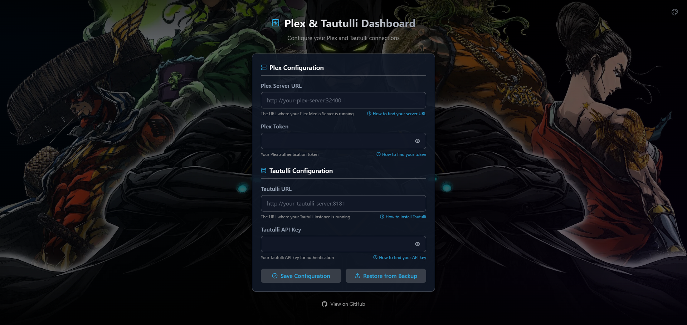
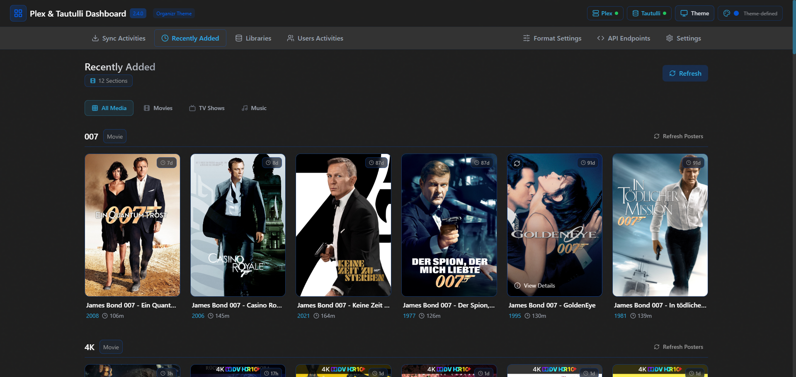

<div align="center">

# 🎬 Plex & Tautulli Dashboard 📊


A modern, elegant dashboard for monitoring your Plex Media Server and Tautulli statistics, featuring a dark-themed UI with customizable displays and real-time monitoring.






</div>

## ✨ Features

<table>
  <tr>
    <td width="50%">
      <h3>🔄 Real-time Activity Monitoring</h3>
      <ul>
        <li>Live view of current streams and downloads</li>
        <li>Media transcoding status</li>
        <li>Custom formatting options for activities</li>
      </ul>
    </td>
    <td width="50%">
      <h3>🎥 Recently Added Media</h3>
      <ul>
        <li>Showcases newest content in your libraries</li>
        <li>Separate views for movies, TV shows, and music</li>
        <li>Customizable display templates</li>
      </ul>
    </td>
  </tr>
  <tr>
    <td width="50%">
      <h3>👥 User Statistics</h3>
      <ul>
        <li>User activity tracking</li>
        <li>Watch time analytics</li>
        <li>Content preferences insights</li>
      </ul>
    </td>
    <td width="50%">
      <h3>📚 Library Management</h3>
      <ul>
        <li>Selectable library sections</li>
        <li>Media count statistics</li>
        <li>Content type breakdown</li>
      </ul>
    </td>
  </tr>
  <tr>
    <td width="50%">
      <h3>🎨 Customizable UI</h3>
      <ul>
        <li>Dark theme with selectable accent colors</li>
        <li>Multiple theme options (Purple, Blue, Green, Orange, Red)</li>
        <li>Responsive design for all devices</li>
        <li>Intuitive, clean interface</li>
      </ul>
    </td>
    <td width="50%">
      <h3>📝 Template System</h3>
      <ul>
        <li>Custom format creators for all data types</li>
        <li>Variable system with preview capabilities</li>
        <li>Section-specific formatting</li>
      </ul>
    </td>
  </tr>
</table>

### Prerequisites

- Node.js (v14+)
- Plex Media Server
- Tautulli installed and configured
- Plex token and Tautulli API key

## 📥 Installation

### Standard Installation

```bash
# Clone the repository
git clone https://github.com/cyb3rgh05t/plex-tautulli-dashboard.git
cd plex-tautulli-dashboard

# Install dependencies
npm install

# Start development servers
npm run dev
```

### Docker Installation (Recommended)

```yaml
version: "3"
services:
  plex-tautulli-dashboard:
    image: cyb3rgh05t/plex-tautulli-dashboard:latest
    container_name: plex-tautulli-dashboard
    ports:
      - "3005:3005" # Frontend
      - "3006:3006" # Backend API
    environment:
      - TZ=Europe/Berlin
      - NODE_ENV=production
      - ALLOWED_ORIGINS=http://your-server-ip:3005
      - PORT=3006
      - VITE_API_BASE_URL=http://your-server-ip:3006
      - VITE_ALLOWED_HOSTS=all # Allow any host to access frontend
      - VITE_ALLOW_ALL_HOSTS=true # Alternative to VITE_ALLOWED_HOSTS
    volumes:
      - ./configs:/app/configs
    restart: unless-stopped
```

## ⚙️ Configuration

### Environment Variables

Create a `.env` file in the root directory:

```env
TZ=Europe/Berlin
NODE_ENV=development
ALLOWED_ORIGINS=http://your-server-ip:3005
PORT=3006
VITE_ALLOWED_HOSTS=all # Allow any host to access frontend
VITE_ALLOW_ALL_HOSTS=true # Alternative to VITE_ALLOWED_HOSTS
VITE_API_BASE_URL=http://your-server-ip:3006
PROXY_TIMEOUT=30000
PROXY_READ_TIMEOUT=30000
PROXY_WRITE_TIMEOUT=30000
```

### Setup Wizard

On first run, you'll need to provide:

1. **Plex Server URL**: `http://your-plex-server:32400`
2. **Plex Token**: Your authentication token
3. **Tautulli URL**: `http://your-tautulli-server:8181`
4. **Tautulli API Key**: Your API key

<details>
<summary><b>🔑 How to find your Plex Token</b></summary>

1. Log in to Plex Web App
2. Open any media item
3. Click the ⋮ (three dots) menu
4. Select "Get Info"
5. Open browser developer tools (F12)
6. Go to the Network tab
7. Look for API requests to Plex - the `X-Plex-Token` parameter will be visible in the request URL

</details>

<details>
<summary><b>🔑 How to find your Tautulli API Key</b></summary>

1. Open Tautulli web interface
2. Go to Settings > Web Interface
3. In the "API" section, you'll find your API key

</details>

## 🖥️ Dashboard Sections

The dashboard consists of several key sections:

### 🎨 Theme Customization

Select your preferred accent color theme:

- 🟣 Purple (default)
- 🔵 Blue
- 🟢 Green
- 🟠 Orange
- 🔴 Red
- ⚪ Grey

All interface elements adapt to your chosen accent color, creating a cohesive visual experience.

### 💾 Backup & Restore

Easily manage your dashboard configuration:

- **Create Backup**: Generate a complete backup of all your settings, formats, and configurations
- **Restore**: Upload a previous backup file to restore your settings
- **Cross-Installation**: Transfer settings between different installations
- **Security**: Backups include only configuration data, not sensitive tokens

### 🔄 Plex Activities

View real-time downloads, streams, and transcodes with custom formatting.

### 🎞️ Recently Added

Browse your latest content additions with customizable display formats for:

- Movies
- TV Shows
- Music

### 📚 Libraries

Select which Plex libraries to display on your dashboard with detailed statistics.

### 👥 Users

Track user activity, watch time, and viewing habits.

### ⚙️ Format Settings

Create custom templates for how information is displayed across the dashboard.

#### Format Variables Example

For TV shows, you could create a format like:

```
{grandparent_title} S{parent_media_index}E{media_index} - {title} ({addedAt:relative})
```

Which would display as:

```
Breaking Bad S05E07 - Say My Name (2 days ago)
```

## 🔌 API Endpoints

The dashboard includes a comprehensive API:

| Endpoint            | Method | Description                                     |
| ------------------- | ------ | ----------------------------------------------- |
| `/api/downloads`    | GET    | Get all current Plex downloads                  |
| `/api/formats`      | GET    | Get all configured format templates             |
| `/api/sections`     | GET    | Get all saved library sections                  |
| `/api/users`        | GET    | Get users with activity information             |
| `/api/recent/:type` | GET    | Get recently added media (movies, shows, music) |
| `/api/media/:type`  | GET    | Get section stats (movies, shows, music)        |
| `/api/libraries`    | GET    | Get all Plex libraries                          |
| `/api/config`       | GET    | Get server configuration                        |
| `/api/formats`      | POST   | Save format templates                           |
| `/api/sections`     | POST   | Save selected library sections                  |
| `/api/config`       | POST   | Update server configuration                     |
| `/api/reset-all`    | POST   | Reset all configurations                        |

## 🏗️ Building for Production

```bash
# Build optimized production files
npm run build

# The build will be available in the dist directory
```

## 🧰 Tech Stack

<table>
  <tr>
    <td align="center"><br>React</td>
    <td align="center"><br>Vite</td>
    <td align="center"><br>TailwindCSS</td>
  </tr>
  <tr>
    <td align="center"><br>Node.js</td>
    <td align="center"><br>Express</td>
    <td align="center"><br>React Query</td>
  </tr>
</table>

## 🤝 Contributing

Contributions are always welcome! Here's how:

1. Fork the repository
2. Create your feature branch (`git checkout -b feature/amazing-feature`)
3. Commit your changes (`git commit -m 'Add some amazing feature'`)
4. Push to the branch (`git push origin feature/amazing-feature`)
5. Open a Pull Request

## 📝 License

This project is licensed under the MIT License - see the LICENSE file for details.

## 🙏 Acknowledgements

- [Plex](https://www.plex.tv/) for their amazing media server
- [Tautulli](https://tautulli.com/) for their Plex monitoring tool
- [React](https://reactjs.org/) and [Vite](https://vitejs.dev/) for the frontend framework
- [TailwindCSS](https://tailwindcss.com/) for the styling
- [Lucide React](https://lucide.dev/) for the icons

---

<div align="center">

Created with ❤️ by [cyb3rgh05t](https://github.com/cyb3rgh05t) for the Plex and Tautulli Community.


</div>
